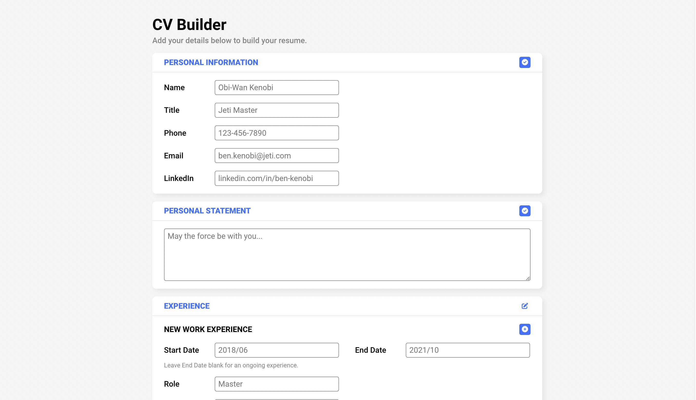

# CV Builder

Enter your information to build an online resume that is beautifully formatted at any screen size.

[Live demo](https://gregolive.github.io/cv-builder/) 👈

## Functionality

- The resume is broken into 5 sections: Personal Information, Personal Statement, Experience, Education, and Skills
- Personal Information and Personal Statement are treated as 'static sections' and Experience, Education, and skills are 'dynamic sections' that allow users to add additional jobs/degrees/skills
- Each sections is saved seperately and a button on the top right of each section allows users to swtich between a 'normal mode' where the section and its inputs are formatted like a CV and an 'edit mode' that allows users to edit/delete the inputs
- The sections entered data (React <code>state</code>) is saved in the user's browser via Javascript's Web Storage API 
- Each input group in a dynamic section is assigned a random id key generated via <code>uniqid</code>
- Date field's are set using a date-picker input and <code>date-fns</code> functions help to format dates in 'normal mode'

## Reflection

This project represented my first 'big' undertaking with React and was an opportunity to solidify my knowledge of <code>props</code> and <code>state</code>. One difficulty I ran into at first was the ability to add multiple job/degree/skill inputs dynamically and correctly implement a <code>handleChange</code> function with multiple inputs. At first I tried using <code>prevState</code> and a few other methods that would not allow for the use of <code>setState</code> without hard coding a specific object key. Eventually I came across the teachique of storing of storing the object ket in an input's <code>name</code> attribute and used the following to handle inputs changes:

````
handleChange = (e) => {
  this.setState({
    education: {
      ...this.state.education, 
      [e.target.name]: e.target.value,
    }
  });
};
````

Editing inputs that had multiple entries presented a similar problem, but I used a similar technique and matched id values to target the proper input:

````
editEducation = (e, targetId) => {
    this.setState({
      educations: this.state.educations.map((edu) => {
        if (edu.id === targetId) { edu[e.target.name] = e.target.value };
        return edu; 
      }),
    });
  };;
};
````

A final roadblock I encountered related to using <code>localStorage</code> and <code>setState</code>. Since setting state in React is asynchronous, there were times when the state was not set properly when saving or fetching data with <code>localStorage</code>,. I was able to fix this by when fetching data with:

````
this.forceUpdate();
````

And when saving data by implementing the save function in <code>setState</code>'s callback:

````
 saveEducation = () => {
    this.setState({
      ...
    }, () => this.storeState());
  };
````

I am unsure, however, if there is a more elegent way of completeing this, especially in the case of using <code>forceUpdate</code>.

## Screenshot


